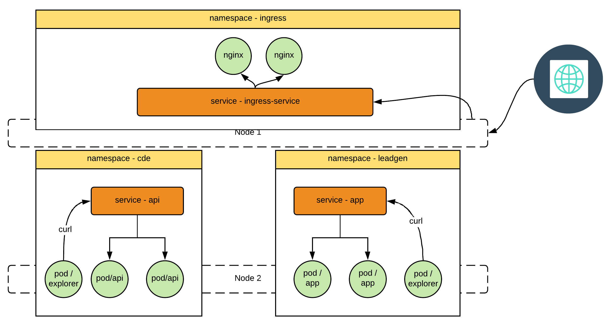

Exploring Ingress Crontroller

Let's create our ingress controller

`kubectl apply -f ingress.yaml`{{execute}}

`kubectl -n ingress get pods -o wide -w`{{execute}}

`clear`{{interrupt execute}}

Create an ingress rule for CDE API

`kubectl apply -f cde-ingress-rule.yaml`{{execute}}

`curl -H 'Host: cde.prospa.com' http://$HOST_IP/api/guid`{{execute}}

`clear`{{execute}}