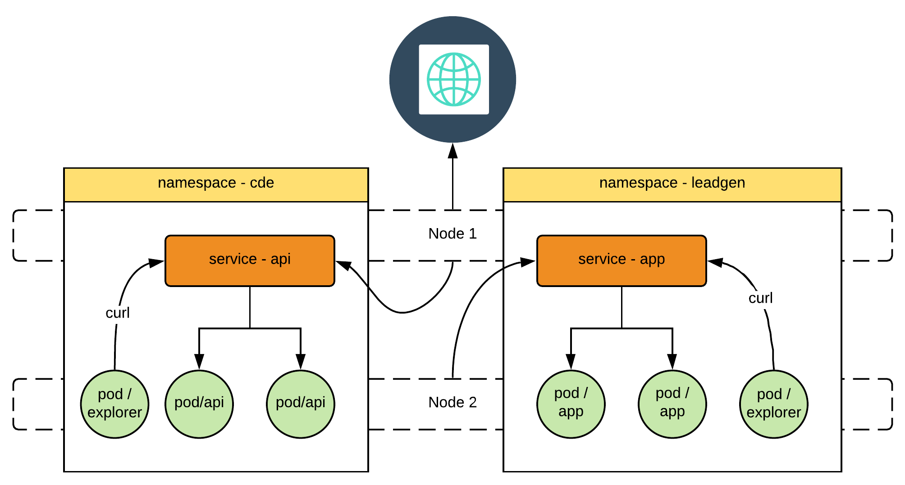

Let's explore service discovery

## Expose the API (cde) on NodePort

`kubectl -n cde apply -f nodeport-api-service.yaml`{{execute}}

`kubectl -n cde get svc`{{execute}}

`clear`{{execute}}

`ip -f inet a | grep "global ens3" | awk '{print $2}'| sed "s/\/16//g"`{{execute}}

`HOST_IP=`{{copy}}

`CDE_NP=30081`{{execute}}

`curl -H 'Host: cde.prospa.com' http://$HOST_IP/api/guid`{{execute}}

`clear`{{execute}}

## Expose the APP (leadgen) on NodePort

`kubectl -n leadgen apply -f nodeport-app-service.yaml`{{execute}}

`kubectl -n leadgen get svc`{{execute}}

`LEADGEN_NP=30081`{{execute}}

`clear`{{execute}}

`curl -H 'Host: leadgen.prospa.com' http://$HOST_IP:$LEADGEN_NP/ShowGuid`{{execute}}

`clear`{{execute}}