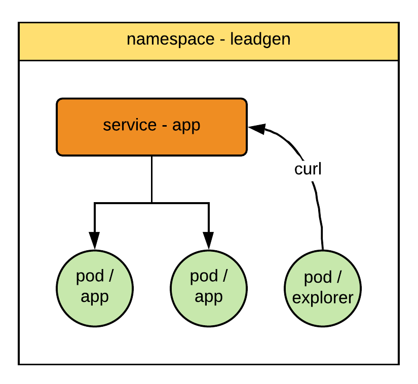

Let's recap what we learned in the previous session.

We created cde service

`kubectl apply -f service-cde.yaml`{{execute}}

See what got created

`kubectl -n cde get all`{{execute}}

Wait until all pods get created

`kubectl -n cde get pods -o wide -w`{{execute}}

We created leadgen service

`kubectl apply -f service-leadgen.yaml`{{execute}}

See what got created

`kubectl -n leadgen get all`{{execute}}

Wait until all pods get created

`kubectl -n leadgen get pods -o wide -w`{{execute}}
