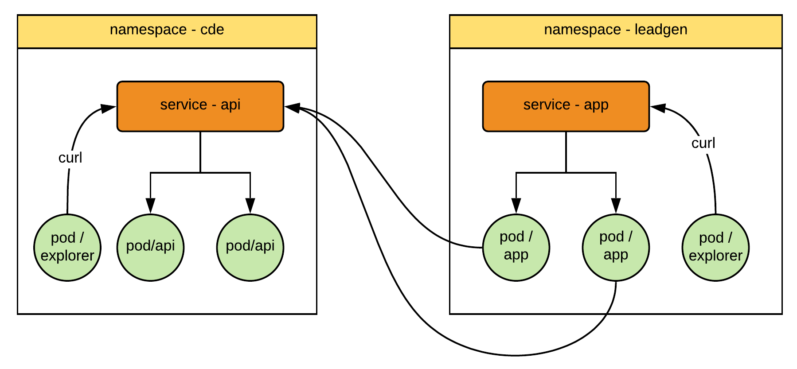

Let's explore service discovery

### Test api Service

exec to explorer pod to test our service

`kubectl -n cde exec -it explorer -c explorer -- bash`{{execute interrupt}}

curl service

`curl -X GET http://api:8080/api/guid`{{execute}}

`curl -X GET http://api.cde:8080/api/guid`{{execute}}

`exit`{{execute}}

### Test app Service

exec to explorer to test our app service in leadgen

`kubectl -n leadgen exec -it explorer -c explorer -- bash`{{execute interrupt}}

curl app service

`curl -X GET http://app:8080/ShowEnv`{{execute}}

`curl -X GET http://app.leadgen:8080/ShowEnv`{{execute}}

`curl -X GET http://app.leadgen:8080/ShowGuid`{{execute}}

`exit`{{execute}}