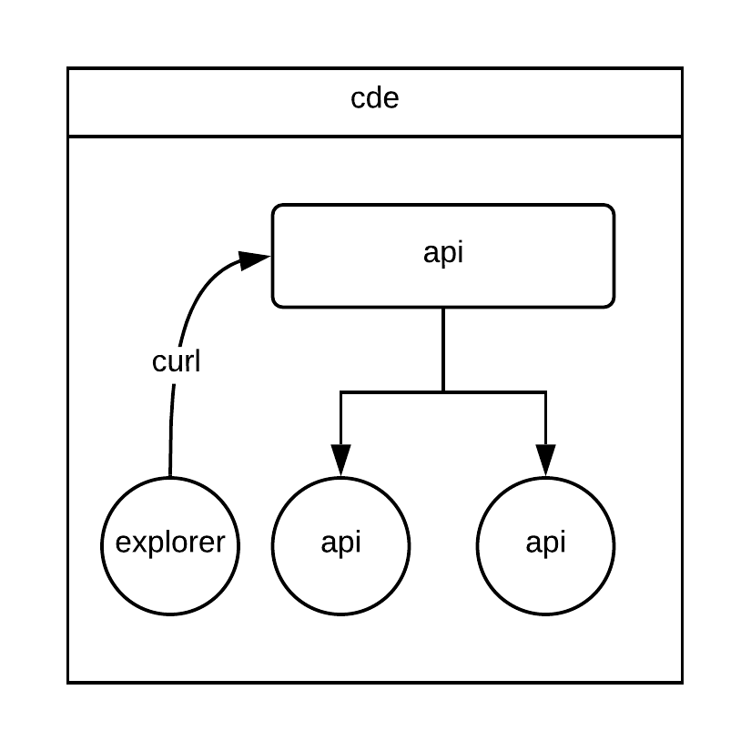

Let's create cde service

Below command creates following:

* Namespace (cde)
* Deployment (api-deployment)
* Service (api)
* Static pod (explorer)

`kubectl apply -f service-cde.yaml`{{execute}}

See what got created

`kubectl -n cde get all`{{execute}}

Wait until all pods get created

`kubectl -n cde get pods -o wide -w`{{execute}}

###Logs

Let's monitor the logs for cde is a new terminal

`kubectl logs -f -n cde -l component=api --all-containers=true`{{execute T2}}